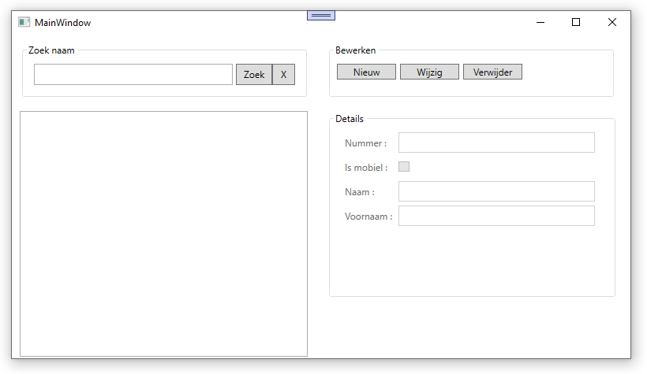
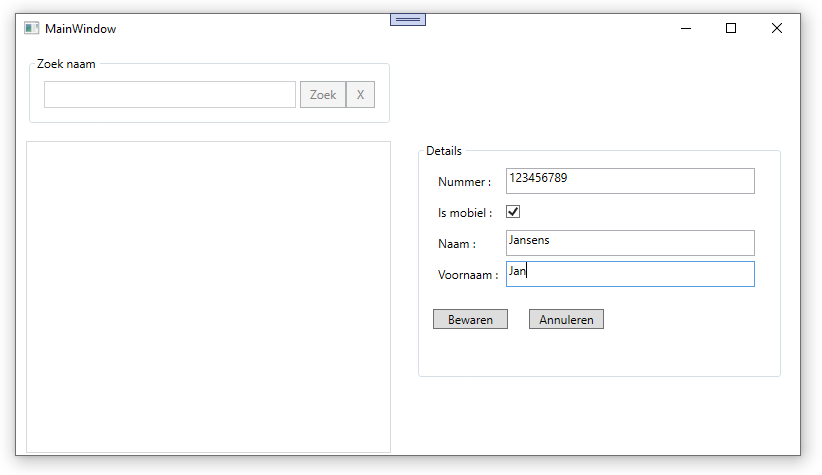
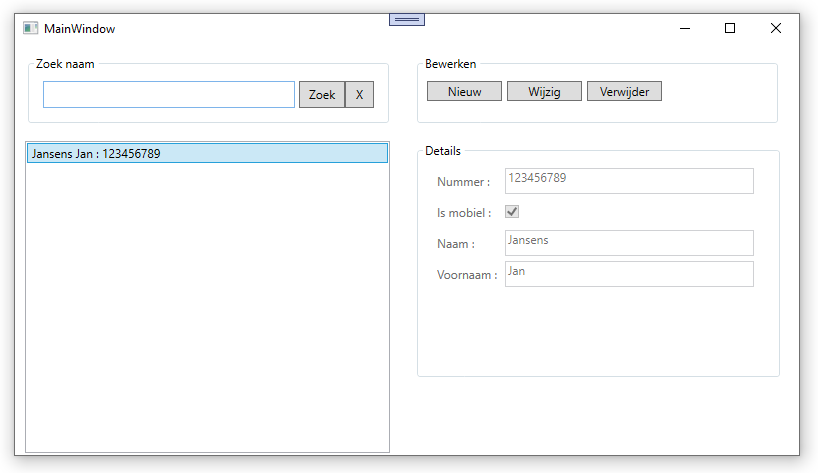

# Oefening disconnected databases : Telefoonboek

## Opdracht
Maak een programma dat telefoonboekgegevens gaat bijhouden in een disconnected database.

## Toelichting
Het programma maakt gebruik van 1 datatable: `telefoonnummers`.
Deze datatable bevat 4 kolommen: 
-	`Nummer`: string, max 50, geen `null` waarden, uniek, primaire sleutel
-	`Mobile`: byte, standaardwaarde = 1 (0 = geen mobiel toestel, 1 = wel mobiel toestel)
-	`Naam`: string, max 100, geen `null` waarden
-	`Voornaam`: string, max 100

De inhoud (en de structuur) van deze tabel dient bij het afsluiten in een XML bestand bewaard te worden, en bij het opstarten uitgelezen te worden.
Het is aangeraden om deze "autosave" functionaliteit als laatste toe te voegen.
Bestaat het XML bestand nog niet, dan dien je de (lege) tabelstructuur uiteraard eerst aan te maken bij het opstarten van de applicatie.

Bij het opstarten zorg je er tevens voor dat: 
-	`grpZoek` ingeschakeld wordt
-	`lstNummers` ingeschakeld wordt
-	`grpBewerken` zichtbaar gemaakt wordt
-	`grpDetails` uitgeschakeld wordt
-	`btnBewaren` en `btnAnnuleren` onzichtbaar gemaakt worden

Wanneer je op `btnNieuw` klikt dan dienen: 
-	`grpZoek` uitgeschakeld te worden
-	`lstNummers` uitgeschakeld te worden
-	`grpBewerken` onzichtbaar gemaakt te worden
-	`grpDetails` ingeschakeld te worden
-	`btnBewaren` en `btnAnnuleren` zichtbaar gemaakt te worden

Je kan nu de gegevens invullen van de nieuwe contactpersoon.

Druk je op `btnAnnuleren` dan kom je terug in de beginsituatie terecht.
Klik je echter op `btnBewaren` dan wordt het telefoonnummer aan de datatable toegevoegd en wordt de listbox `lstNummers` bijgewerkt.
Na het bewaren van de gegevens wordt het nieuw aangemaakt telefoonnummer meteen ook geselecteerd in de lijst.

Wijzigen van bestaande gegevens met de knop `btnWijzig` verloopt analoog als het aanmaken van nieuwe gegevens met de knop `btnNieuw`.
Uiteraard worden in dit geval de eigenschappen van het bestaande telefoonnummer overschreven in plaats van een nieuw telefoonnummer toe te voegen.
Ook hier kan je de wijziging annuleren met de knop `btnAnnuleren` waarna je de editeermodus terug verlaat.

De listbox `lstNummers` dient gevuld te worden met `Naam + " " + voornaam + " : " + telefoonnummer`.
Telkens een telefoonnummer toegevoegd, gewijzigd of verwijderd wordt dient deze listbox bijgewerkt te worden.
Wordt in `lstNummers` een item geselecteerd, dan dienen de detailgegevens in de corresponderende controls binnen `grpDetails` getoond te worden.
De controls binnen `grpDetails` blijven echter uitgeschakeld tot je in editeermodus gaat via de knop `btnWijzig`.

## Zoekvak

Wordt bovenaan in `txtZoek` een waarde ingevoerd en vervolgens op `btnZoek` geklikt, dan dient de listbox beperkt te worden tot de items in wiens naam de ingevoerde tekst voorkomt.
Wordt op `btnEindeZoek` geklikt, dan dient `txtZoek` leeg gemaakt te worden en dienen terug alle items getoond te worden.
Wanneer er een zoekopdracht actief is, kan je nog steeds telefoonnummers in de gefilterde lijst selecteren om hun gegevens te bekijken en eventueel aan te passen.
Zorg ervoor dat je ook nog steeds nieuwe telefoonnummers kan toevoegen terwijl en een zoekopdracht actief is:
- Als het nieuwe contact voldoet aan de zoekopdracht, wordt het getoond en geselecteerd in de gefilterde lijst (idem als wanneer er geen filter actief is).
- Voldoet het nieuwe contact niet aan de actieve zoekopdracht, dan zie je het na bewaren **niet** meteen in de lijst. Wis je echter de actieve filter met de knop `btnEindeZoek`, dan zie je opnieuw alle telefoonnummers in de lijst, inclusief het zonet toegevoegde nummer.

## Extra: sorteren
Zorg ervoor dat de contactpersonen in de lijst steeds alfabetisch gesorteerd staan.

## Extra: knoppen "Wijzig" en "Verwijder" verbergen
In de basisoplossing zorg je ervoor dat er niks gebeurt wanneer je op `btnWijzig` of `btnVerwijder` klikt terwijl er geen telefoonnummer in de lijst geselecteerd is (bv. omdat de lijst nog leeg is of omdat de applicatie net opgestart is). Mooier is natuurlijk om ervoor te zorgen dat deze twee knoppen enkel ingeschakeld zijn indien je effectief een telefoonnumer hebt geselecteerd.