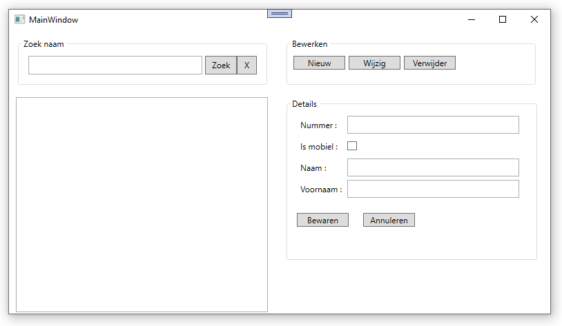

# Oefening disconnected databases : Telefoonboek

## Opdracht
Maak een programma dat telefoonboekgegevens gaat bijhouden in een disconnected database.

## Toelichting
Het programma maakt gebruik van 1 datatable: `telefoonnummers`.
Deze datatable bevat 4 kolommen: 
-	`Nummer`: string, max 50, geen `null` waarden, uniek, primaire sleutel
-	`Mobile`: byte, standaardwaarde = 1 (0 = geen mobiel toestel, 1 = wel mobiel toestel)
-	`Naam`: string, max 100, geen `null` waarden
-	`Voornaam`: string, max 100

De inhoud (en de structuur) van deze tabel dient bij het afsluiten in een XML bestand bewaard te worden, en bij het opstarten uitgelezen te worden.
Het is aangeraden om deze "autosave" functionaliteit als laatste toe te voegen.
Bestaat het XML bestand nog niet, dan dien je de (lege) tabelstructuur uiteraard eerst aan te maken bij het opstarten van de applicatie.

Bij het opstarten zorg je er tevens voor dat: 
-	`grpZoek` ingeschakeld wordt
-	`lstNummers` ingeschakeld wordt
-	`grpBewerken` zichtbaar gemaakt wordt
-	`grpDetails` uitgeschakeld wordt
-	`btnBewaren` en `btnAnnuleren` onzichtbaar gemaakt worden

Wanneer we straks op `btnNieuw` of `btnWijzigen` gaan klikken dan dienen: 
-	`grpZoek` uitgeschakeld te worden
-	`lstNummers` uitgeschakeld te worden
-	`grpBewerken` onzichtbaar gemaakt te worden
-	`grpDetails` ingeschakeld te worden
-	`btnBewaren` en `btnAnnuleren` zichtbaar gemaakt te worden

De listbox `lstNummers` dient gevuld te worden met `Naam + " " + voornaam + " : " + telefoonnummer`.
Telkens een telefoonnummer toegevoegd, gewijzigd of verwijderd wordt dient deze listbox bijgewerkt te worden.
Wordt in `lstNummers` een item geselecteerd, dan dienen de detailgegevens in de corresponderende controls binnen `grpDetails` getoond te worden.

Wordt bovenaan in `txtZoek` een waarde ingevoerd en vervolgens op `btnZoek` geklikt, dan dient de listbox beperkt te worden tot de items in wiens naam de ingevoerde tekst voorkomt.
Wordt op `btnEindeZoek` geklikt, dan dient `txtZoek` leeg gemaakt te worden en dienen terug alle items getoond te worden.
